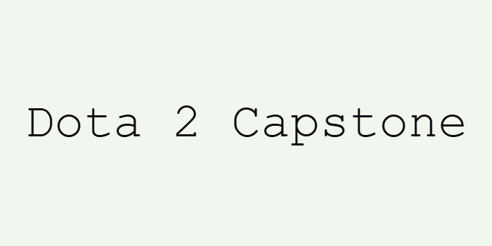

# NSS-Full-Time-Data-Analytics-14-Capstone-Dota2

# NSS DDA-14 Capstone Project

# Motivation
This project is near and dear to my heart.  I have been a fan of Dota since I firsted played in 2005.  
I wanted to delve deeper into the main attraction for dota players which is The International and why it was so successful.
The motivation was to dive into the data surrounding The International and to uncover
insights that was unobtainable to me initally. Motivation
Here you will go into more detail about why you have chosen this project.
I have been watching and playing Dota 2 since it was Dota 1(Dota Allstars) on Warcraft 3: Reign of Chaos custom maps.
I love the game and think there would be enough data to find and clean in order to make a presentation.
I have watched every International and have attended 2 of them in person.  

# Data questions
1. The true history behind the creation of DotA(how and why it began) 
2. How much money was made by players and teams throughout the years 
3. As a worldwide esports game, which players participated from each country 
4. Attendance and viewing numbers for The International
5. How much money was made by the parent company Valve 
6. Why was there such a decline in The International prize pool 
7. Esports Stars

# Minimum Viable Product (MVP)
The intended target will be fans of gaming specifically MOBA genre

This presentation will be a 10 to 14 minute presentation via canva.

1.	What a multi-online battle arena (moba) is. Opening statement history of DotA with insights on initial creation from used mapped setting in Starcraft (Aeon of Strife), transition to DotA allstars(Warcraft) to the current version of Dota2 (stand-alone) (1:30 mins to 2 mins)

2.	Information on how and why The International started (text)
a.	Valve creating Dota 2 and hosting first tournament (text)
b.	Initial Prize Pool (1 to 2 mins)

3.	Winners of The International (2 mins)
a.	Introduction to crowd funding (the compendium)
i.	Picture examples
ii.	What the compendium is
iii.	Online ticket purchasing for in-game viewing (before twitch)
b.	Total prize pool for each tournament (bar graph initial international colors)
c.	Total prize pool for winners (bar graph color for specific tournament)

4.	Statistics on country participation (2 mins)
a.	How many teams participated each year (bar chart)
b.	Total participating players representing each country (bar chart)

5.	The historical impact this specific tournament had on games/gaming careers (2 Mins)
a.	Viewership count via online streaming (text or bar graph)
b.	E-sports stars (dota 2) – note some prolific players who played and still maintain an online streaming following generating income (text and pictures and total earnings)

6.	Once prominent The International has seen a decline in prize money due to a change in the policy (greed vs community inclusion) (2 mins)
a.	Compare initial rise of the international (bar chart)
b.	Show decline in the prize money due to no crowd funding(bar chart) 
c.	Insights on why crowd funding declined from changes in the compendium refer to total winnings chart(text)
d.	How much valve made roughly (Crowd funding years x 3 (estimate as valve stated it will contribute 25% to winners)
e.	Greed vs inclusion (treasure releases not related to TI)

# Technology Tools
Python
Jupyter Notebooks
pandas
requests

Excel
Canva for presentation

# The Process
Acquring the data
I scraped the total players from each country from liquipedia.com and scraped the prize pool amounts
from wikipedia.com using Python requests and pandas.  Data was also acquired through listed websites in the data source section by scraping

# Cleaning Data
Data was cleaned using excel and python

# Data Sources
Document the data you use and the source of that data
Data:
(resource for data formation ideas) Kaggle: https://www.kaggle.com/datasets/arpan129/dota-2-the-international-complete-dataset
Liquipedia: https://liquipedia.net/dota2/The_International
Wikipedia: https://en.wikipedia.org/wiki/The_International_(esports)
Escharts: https://escharts.com/games/dota2
Stratz.com: https://stratz.com/leagues/15728/main-event
Ggscore.com: https://ggscore.com/en/dota-2
Wowpedia.fandom.com:https://wowpedia.fandom.com/wiki/Defense_of_the_Ancients:_Allstars
Starcraft.fandom.com: https://starcraft.fandom.com/wiki/Aeon_of_Strife_(map)
News article from David Dannelly: https://daviddannelly.com/blog/zjYm/the-origin-of-the-moba-aeon-of-strife-and-defense-of-the-ancients
Presentation via canva: https://canva.com
Dota2fandom: https://dota2.fandom.com/wiki

# Known Issues and Challenges

Explain any anticipated challenges with your project, and your plan for managing them. Be sure to include:
●	If you need to request data or an api key
●	Based on your data sources, known data cleaning steps

# Challenges:

1. Finding out how much money Valve made each year
2. Finding attendance records for The International at the arenas
3. Web scrapping skills are limited
4. Finding old pictures of Aeon of Strife        
